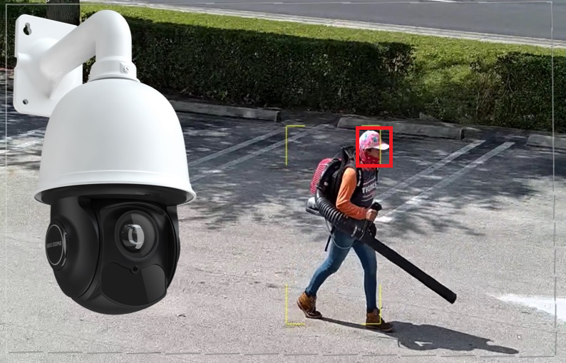

# Suivi Facial physique avec IA

## Description

Ce projet utilise l'intelligence artificielle pour suivre le visage d'une personne dans une vidéo en temps réel. La caméra s'ajuste automatiquement pour maintenir le visage de la personne au centre du cadre.

## Démo

## Fonctionnalités

- Suivi en temps réel du visage dans la vidéo.
- Ajustement automatique de la caméra pour maintenir le visage au centre.

## Configuration Requise

- Source vidéo fonctionnelle.
- GPU compatible avec CUDA (pour des performances optimales).

## Auteur
- Douraïd BEN HASSEN
